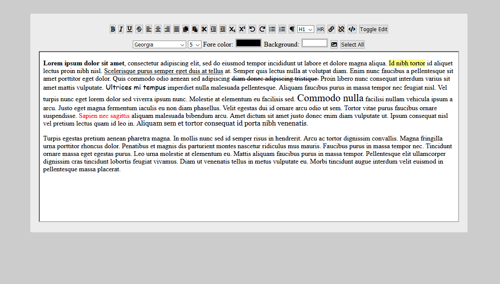
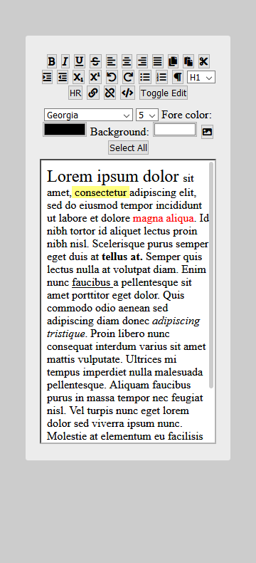

# Rich-Text-Editor
With the help of tutorials I managed to build a WYSIWYG (What You See Is What You Get) text editor using mostly HTML, CSS and some js.

### About the code
When an HTML document has been changed to designMode, the document object exposes the execCommand method which allows you to execute commands to manipulate the content of the editable region. 
You can learn more here <a href="https://developer.mozilla.org/es/docs/Web/API/Document/execCommand">Document.execCommand()</a>.

###  Here some screenshots
## Full Page view

## Responsive view

### Or you can also see it like a site deploy at:
<a href="https://rich-text-editor.netlify.app/">Rich Text Editor on netlify</a>
